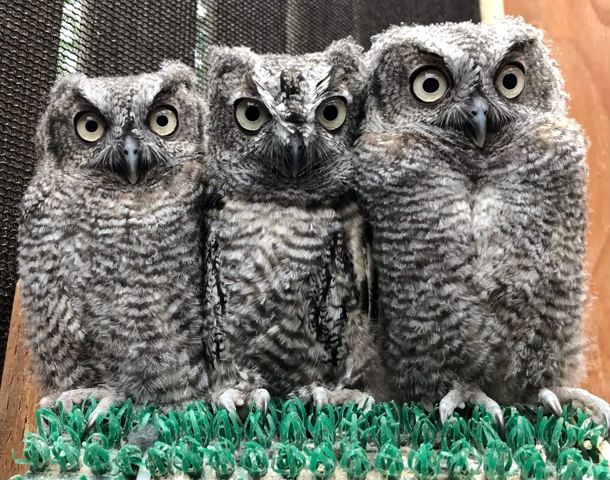
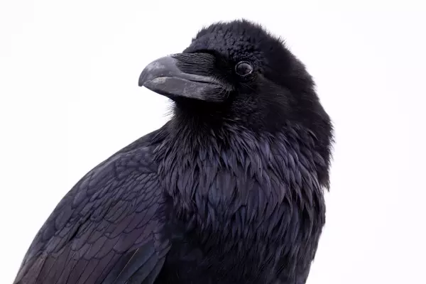

<h1 align="center">Bird Adoption App</h1>

  

<h6 align="center">Featured Birds: Orphaned Western Screech Owls</h6>

Welcome to the Bird Adoption App! This application allows you to browse through a variety of birds, add them to your cart, and proceed with the adoption process. Below is a guide on how to use the app.

## Getting Started
- **Launch the App**: Open the application by navigating to https://regal-hamster-41f1a9.netlify.app/ and start exploring the available birds for adoption.

## Exploring Birds

  

<h6 align="center">Featured Bird: Raven</h6>

- **View Birds**: On the main page, you'll see a list of birds, each displayed on its own card.
- **Bird Details**: Each card shows the bird's name, an image, and its adoption price.
- **Adopt a Bird**: If you find a bird you like, click on the `Adopt` button to add it to your cart.

## Managing Your Cart

- **View Cart**: Your cart is visible on the same page, usually on the side or at the top.
- **Cart Details**: In the cart, you will see the names and quantities of the birds you've chosen, along with the total cost.
- **Remove Birds**: If you change your mind, you can remove a bird from the cart.
- **Discounts**: If you have three or more birds in your cart, a 10% discount is automatically applied to your total cost.

## Bonus Items

- **Earn Bonuses**: Depending on the total cost of your cart, you can earn bonus items.
- **Bonus Thresholds**: Bonus items are awarded at different cost thresholds: $100, $300, $500, and $1000.

## Checking Out

- **Proceed to Checkout**: Once you're ready to adopt, navigate to the checkout section.
- **Fill Out the Form**: Complete the form with your details.
- **Submit**: Submit your adoption request.
- **Confirmation**: After submitting, you will receive a confirmation message thanking you for the adoption.
- **Reset Cart**: Upon completing the checkout process, your cart will be reset, and you can start again if you wish.

## Thank You

Thank you for choosing to adopt a bird through our app. Your support helps us continue our mission to find loving homes for these beautiful creatures. If you have any questions or feedback, please don't hesitate to contact us. Happy bird adopting!