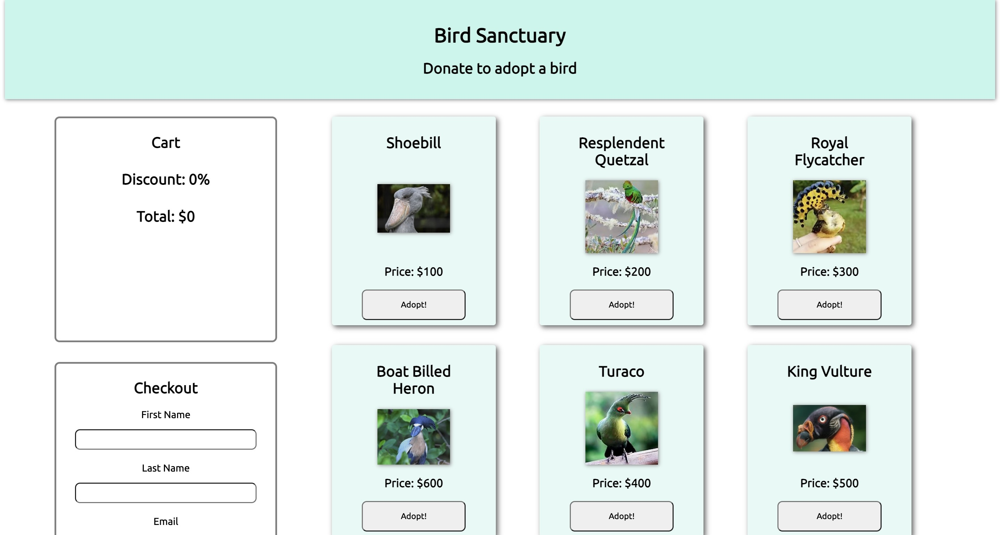

# Bird Sanctuary ReactJS Project

## Introduction

A bird sanctuary donation app has been created using React by a previous developer. The application has been reviewed and optimized for a user to fully have access and get the most of the app. This app will allow for users to:

- View the birds that are up for adoption
- Adopt a bird and visually see it appear in their cart
- Have a fully functioning cart that displays their total, discount and birds
- Receive 10% discount from the total amount if they adopt three or more birds
- Receive bonus items in their cart if they qualify for certain promotions
- Remove a bird from their cart
- Fill out a form with their information in order to check out

## Installation

- Fork and clone this repository.
- Open the repository in VS Code by using this command in the terminal `code .`
- Run the command `npm install` in order to install the necessary packets
- Run the command `npm run dev` in order to view the landing page of the website

If you've followed all the steps it should look something like this!

## How to Use

### Adopt a Bird

As soon as the page loads you will be greeted with several birds that are up for adoption. They will be displayed in the shape of a card form along with their name, image and price.

Once you wish to adopt a bird all you have to do is select the bird you want and hit that adopt button. The bird will then be added to your cart.

- As you add more birds to your cart you will then see you may qualify for some of the promotions below!

  - Earn a 10% discount off your total purchase if you adopt three or more birds

  - 1 bonus item if your total is between `$100` and `$300`
  - 2 bonus items if your total is between `$300` and `$500`
  - 3 bonus items if your total is between `$500` and `$1000`
  - 4 bonus items if your total is over `$1000`

### Remove a Bird

If you wish to remove a bird that you added to your cart. All you have to do is hit that remove button that pertains to the bird you wish to remove.

_Note: If you remove a bird the total, bonuses and discount may potentially be modified as well_

### Checkout

Once you have selected all the birds you wish to adopt. Head over to the form and fill in the blanks along with your appropriate personal information. Once you've filled everything out hit that submit button. An alert should appear on your page stating `Congratulations [name]! You have successfully adopted birds. Thank you!`

### Edge Cases

- The app will not allow you to checkout if you fill out the form and don't have any birds in your cart. You will be displayed with an alert message stating `You must adopt a bird in order to checkout!`

- The app will also require for you to input all the fields in the checkout form before finalizing.

### From the Dev

Carlitos Dutan thanks you for visiting our application!
